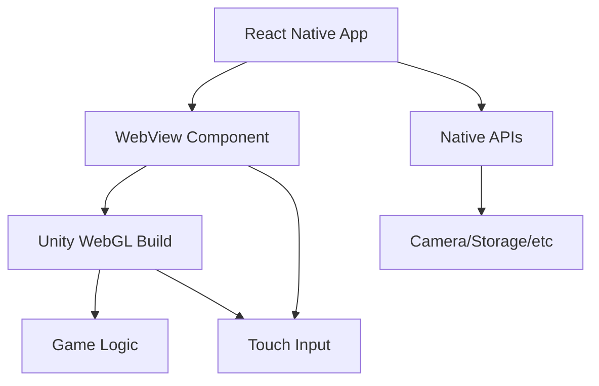

## Overview

WPM Typing Tutor extends to mobile platforms through **React Native** with **Expo Go**, providing a native mobile experience for Android and iOS devices. The mobile app wraps the Unity WebGL build within a WebView, enabling cross-platform gameplay with native mobile integration.

<Info>
  **Framework**: React Native with Expo SDK
  
  **Deployment**: Expo Go app
  
  **Platforms**: Android (available), iOS (coming soon)
  
  **Unity Integration**: WebView wrapper
</Info>

## Architecture Overview

The mobile app uses a hybrid architecture:

<Steps>
  <Step title="React Native Shell">
    A React Native application provides:
    - Native mobile app structure
    - Navigation and UI framework
    - Platform-specific capabilities
    - App lifecycle management
  </Step>
  
  <Step title="WebView Container">
    The game runs inside a WebView component:
    - Loads Unity WebGL build from hosted URL
    - Provides JavaScript bridge for native communication
    - Handles touch input and gestures
    - Manages viewport and orientation
  </Step>
  
  <Step title="Unity WebGL Game">
    The same Unity build used for web:
    - No modifications needed to Unity code
    - Touch events work automatically
    - Responsive to viewport changes
    - Same gameplay experience
  </Step>
</Steps>



## Expo Configuration

### Project Setup

The app is configured using Expo's managed workflow:

<CodeGroup>
```json app.json
{
  "expo": {
    "name": "WPM Typing Tutor",
    "slug": "wpm-typing-tutor",
    "version": "1.0.0",
    "orientation": "landscape",
    "icon": "./assets/icon.png",
    "userInterfaceStyle": "dark",
    "splash": {
      "image": "./assets/splash.png",
      "resizeMode": "contain",
      "backgroundColor": "#0d0d0d"
    },
    "platforms": ["ios", "android"],
    "android": {
      "package": "com.wpm.typingtutor",
      "adaptiveIcon": {
        "foregroundImage": "./assets/adaptive-icon.png",
        "backgroundColor": "#0d0d0d"
      },
      "permissions": []
    },
    "ios": {
      "bundleIdentifier": "com.wpm.typingtutor",
      "supportsTablet": true
    }
  }
}
```

```json package.json
{
  "name": "wpm-typing-tutor-mobile",
  "version": "1.0.0",
  "main": "node_modules/expo/AppEntry.js",
  "scripts": {
    "start": "expo start",
    "android": "expo start --android",
    "ios": "expo start --ios",
    "web": "expo start --web"
  },
  "dependencies": {
    "expo": "~50.0.0",
    "react": "18.2.0",
    "react-native": "0.73.0",
    "react-native-webview": "^13.6.3",
    "expo-splash-screen": "~0.26.0",
    "expo-status-bar": "~1.11.0"
  }
}
```
</CodeGroup>

<Note>
  The mobile app uses **landscape orientation** by default to match the Unity WebGL game's design and provide the best typing experience.
</Note>

## WebView Integration

### Basic Implementation

The core of the mobile app is a WebView component that loads the Unity game:

<CodeGroup>
```jsx App.js - Basic WebView
import React from 'react';
import { StyleSheet, View } from 'react-native';
import { WebView } from 'react-native-webview';
import { StatusBar } from 'expo-status-bar';

export default function App() {
  return (
    <View style={styles.container}>
      <StatusBar hidden />
      <WebView
        source={{ uri: 'https://your-domain.com' }}
        style={styles.webview}
        javaScriptEnabled={true}
        domStorageEnabled={true}
        startInLoadingState={true}
        scalesPageToFit={true}
        allowsFullscreenVideo={false}
      />
    </View>
  );
}

const styles = StyleSheet.create({
  container: {
    flex: 1,
    backgroundColor: '#0d0d0d',
  },
  webview: {
    flex: 1,
  },
});
```

```jsx App.js - Advanced with Loading
import React, { useState } from 'react';
import { StyleSheet, View, ActivityIndicator, Text } from 'react-native';
import { WebView } from 'react-native-webview';
import { StatusBar } from 'expo-status-bar';

export default function App() {
  const [loading, setLoading] = useState(true);
  const [error, setError] = useState(null);

  return (
    <View style={styles.container}>
      <StatusBar hidden />
      
      {loading && (
        <View style={styles.loadingContainer}>
          <ActivityIndicator size="large" color="#39d353" />
          <Text style={styles.loadingText}>Loading WPM Typing Tutor...</Text>
        </View>
      )}
      
      <WebView
        source={{ uri: 'https://your-domain.com' }}
        style={styles.webview}
        javaScriptEnabled={true}
        domStorageEnabled={true}
        startInLoadingState={true}
        scalesPageToFit={true}
        onLoadStart={() => setLoading(true)}
        onLoadEnd={() => setLoading(false)}
        onError={(syntheticEvent) => {
          const { nativeEvent } = syntheticEvent;
          setError(nativeEvent);
          setLoading(false);
        }}
        renderError={(errorName) => (
          <View style={styles.errorContainer}>
            <Text style={styles.errorText}>Failed to load game</Text>
            <Text style={styles.errorDetail}>{errorName}</Text>
          </View>
        )}
      />
    </View>
  );
}

const styles = StyleSheet.create({
  container: {
    flex: 1,
    backgroundColor: '#0d0d0d',
  },
  webview: {
    flex: 1,
  },
  loadingContainer: {
    position: 'absolute',
    top: 0,
    left: 0,
    right: 0,
    bottom: 0,
    justifyContent: 'center',
    alignItems: 'center',
    backgroundColor: '#0d0d0d',
    zIndex: 1000,
  },
  loadingText: {
    marginTop: 16,
    color: '#c8c8c8',
    fontSize: 14,
    fontFamily: 'monospace',
  },
  errorContainer: {
    flex: 1,
    justifyContent: 'center',
    alignItems: 'center',
    backgroundColor: '#0d0d0d',
    padding: 20,
  },
  errorText: {
    color: '#ff5f56',
    fontSize: 18,
    fontWeight: 'bold',
    marginBottom: 8,
  },
  errorDetail: {
    color: '#c8c8c8',
    fontSize: 12,
    fontFamily: 'monospace',
  },
});
```
</CodeGroup>

### WebView Configuration Options

Critical WebView props for Unity WebGL:

<Tabs>
  <Tab title="JavaScript">
    ```jsx
    javaScriptEnabled={true}
    ```
    **Required** for Unity WebGL to run. Unity uses JavaScript extensively for WebGL initialization and game logic.
  </Tab>
  
  <Tab title="Storage">
    ```jsx
    domStorageEnabled={true}
    ```
    Enables localStorage for save data, settings, and Unity's PlayerPrefs system.
  </Tab>
  
  <Tab title="Scaling">
    ```jsx
    scalesPageToFit={true}
    ```
    Automatically scales the web content to fit the mobile viewport.
  </Tab>
  
  <Tab title="Loading State">
    ```jsx
    startInLoadingState={true}
    ```
    Shows a loading indicator while the Unity game initializes.
  </Tab>
</Tabs>

## Touch Input Handling

### Unity Touch Events

Unity WebGL automatically handles touch input:

```javascript Unity Touch Support
// Unity's Input system maps touch to mouse events:
// - Touch = Mouse click
// - Swipe = Mouse drag
// - Pinch = Not supported (not needed for typing game)

// In Unity C# code, use standard input:
if (Input.GetMouseButtonDown(0)) {
    // Handles both mouse clicks and touch
}

// Or use Unity's Touch API directly:
if (Input.touchCount > 0) {
    Touch touch = Input.GetTouch(0);
    if (touch.phase == TouchPhase.Began) {
        // Handle touch
    }
}
```

### Keyboard Input on Mobile

<Warning>
  The typing game requires a physical or virtual keyboard. On mobile devices:
  - Android: Virtual keyboard automatically appears
  - iOS: Virtual keyboard can be triggered programmatically
  - Best experience: External Bluetooth keyboard
</Warning>

<CodeGroup>
```jsx Keyboard Management
import React, { useEffect } from 'react';
import { Keyboard } from 'react-native';
import { WebView } from 'react-native-webview';

export default function GameView() {
  useEffect(() => {
    // Keep keyboard visible during gameplay
    const showSubscription = Keyboard.addListener('keyboardDidShow', () => {
      console.log('Keyboard shown');
    });
    
    const hideSubscription = Keyboard.addListener('keyboardDidHide', () => {
      console.log('Keyboard hidden');
    });

    return () => {
      showSubscription.remove();
      hideSubscription.remove();
    };
  }, []);

  return (
    <WebView
      source={{ uri: 'https://your-domain.com' }}
      // ... other props
    />
  );
}
```

```html HTML Input Focus
<!-- On the web page, add hidden input to trigger keyboard -->
<input 
  type="text" 
  id="mobile-keyboard-trigger"
  style="position: absolute; left: -9999px;"
  autofocus
/>

<script>
// Focus input when game starts to show keyboard
function showMobileKeyboard() {
  const input = document.getElementById('mobile-keyboard-trigger');
  if (input) {
    input.focus();
  }
}

// Call this when game scene loads
showMobileKeyboard();
</script>
```
</CodeGroup>

## JavaScript Bridge

Communicate between React Native and Unity using the WebView JavaScript bridge:

<CodeGroup>
```jsx React Native to Unity
import React, { useRef } from 'react';
import { View, Button } from 'react-native';
import { WebView } from 'react-native-webview';

export default function App() {
  const webViewRef = useRef(null);

  // Send message to Unity
  const sendToUnity = (message) => {
    webViewRef.current?.injectJavaScript(`
      if (window.unityInstance) {
        window.unityInstance.SendMessage('GameManager', 'ReceiveMessage', '${message}');
      }
      true;
    `);
  };

  return (
    <View style={{ flex: 1 }}>
      <WebView
        ref={webViewRef}
        source={{ uri: 'https://your-domain.com' }}
        onMessage={(event) => {
          // Receive messages from Unity
          const data = JSON.parse(event.nativeEvent.data);
          console.log('Message from Unity:', data);
        }}
      />
      <Button 
        title="Start Game" 
        onPress={() => sendToUnity('START')} 
      />
    </View>
  );
}
```

```csharp Unity C# to React Native
// In Unity C# script
using UnityEngine;
using System.Runtime.InteropServices;

public class MobileBridge : MonoBehaviour
{
    [DllImport("__Internal")]
    private static extern void SendToReactNative(string message);

    // Send message to React Native
    public void SendScore(int score)
    {
        if (Application.platform == RuntimePlatform.WebGLPlayer)
        {
            string jsonData = JsonUtility.ToJson(new ScoreData { score = score });
            SendToReactNative(jsonData);
        }
    }
    
    // Receive message from React Native
    public void ReceiveMessage(string message)
    {
        Debug.Log("Received from React Native: " + message);
        
        if (message == "START")
        {
            StartGame();
        }
    }
}

[System.Serializable]
public class ScoreData
{
    public int score;
}
```

```javascript JavaScript Bridge Setup
// Add to your HTML page
<script>
  // Bridge function for Unity to call
  function SendToReactNative(message) {
    if (window.ReactNativeWebView) {
      window.ReactNativeWebView.postMessage(message);
    }
  }
  
  // Make it available globally
  window.SendToReactNative = SendToReactNative;
</script>
```
</CodeGroup>

## Development Workflow

### Local Development with Expo

<Steps>
  <Step title="Install Expo CLI">
    ```bash
    npm install -g expo-cli
    ```
  </Step>
  
  <Step title="Create Expo Project">
    ```bash
    npx create-expo-app wpm-typing-tutor-mobile
    cd wpm-typing-tutor-mobile
    ```
  </Step>
  
  <Step title="Install Dependencies">
    ```bash
    npm install react-native-webview
    npx expo install expo-splash-screen expo-status-bar
    ```
  </Step>
  
  <Step title="Configure App">
    Edit `app.json` with your app configuration (see above examples).
  </Step>
  
  <Step title="Start Development Server">
    ```bash
    npx expo start
    ```
    
    This opens the Expo Developer Tools in your browser.
  </Step>
  
  <Step title="Test on Device">
    **Android:**
    - Install Expo Go from Play Store
    - Scan QR code from Expo Dev Tools
    
    **iOS:**
    - Install Expo Go from App Store
    - Scan QR code with Camera app
  </Step>
</Steps>

<Note>
  During development, you can point the WebView to `localhost` if running the web server locally, or use a tunneling service like ngrok for remote testing.
</Note>

### Testing with Local Unity Build

```jsx Development Configuration
// Point to local development server
const DEV_MODE = __DEV__; // Expo provides this automatically

const GAME_URL = DEV_MODE 
  ? 'http://192.168.1.100:3000' // Your local IP
  : 'https://your-production-domain.com';

export default function App() {
  return (
    <WebView
      source={{ uri: GAME_URL }}
      // ... other props
    />
  );
}
```

## Platform-Specific Features

### Android Configuration

<Tabs>
  <Tab title="Permissions">
    ```json app.json
    {
      "android": {
        "permissions": [
          // Add only required permissions
          // WPM Typing Tutor doesn't need any special permissions
        ]
      }
    }
    ```
  </Tab>
  
  <Tab title="Adaptive Icon">
    ```json app.json
    {
      "android": {
        "adaptiveIcon": {
          "foregroundImage": "./assets/adaptive-icon.png",
          "backgroundColor": "#0d0d0d"
        }
      }
    }
    ```
    
    Create a 1024x1024px icon with transparent background.
  </Tab>
  
  <Tab title="Build Settings">
    ```json app.json
    {
      "android": {
        "package": "com.wpm.typingtutor",
        "versionCode": 1,
        "buildToolsVersion": "34.0.0",
        "compileSdkVersion": 34,
        "targetSdkVersion": 34
      }
    }
    ```
  </Tab>
</Tabs>

### iOS Configuration (Coming Soon)

<Warning>
  iOS support is planned but not yet available. The configuration is prepared for future release.
</Warning>

```json app.json - iOS Settings
{
  "ios": {
    "bundleIdentifier": "com.wpm.typingtutor",
    "buildNumber": "1.0.0",
    "supportsTablet": true,
    "infoPlist": {
      "UIRequiresFullScreen": true,
      "UIStatusBarHidden": true
    }
  }
}
```

## Performance Optimization

### WebView Performance

<CardGroup cols={2}>
  <Card title="Hardware Acceleration" icon="gauge-high">
    Enable hardware acceleration in WebView for better Unity performance:
    
    ```jsx
    <WebView
      androidLayerType="hardware"
      // ... other props
    />
    ```
  </Card>
  
  <Card title="Cache Management" icon="database">
    Enable caching to speed up subsequent loads:
    
    ```jsx
    <WebView
      cacheEnabled={true}
      cacheMode="LOAD_CACHE_ELSE_NETWORK"
    />
    ```
  </Card>
  
  <Card title="Memory Management" icon="memory">
    Unity WebGL can be memory-intensive. Monitor memory usage and reload WebView if needed.
  </Card>
  
  <Card title="Loading Optimization" icon="rocket">
    Show splash screen during initial load:
    
    ```jsx
    import * as SplashScreen from 'expo-splash-screen';
    
    SplashScreen.preventAutoHideAsync();
    // Hide when WebView loads:
    SplashScreen.hideAsync();
    ```
  </Card>
</CardGroup>

### Unity WebGL Mobile Optimization

```csharp Unity Mobile Optimizations
// Detect mobile in Unity and adjust settings
if (Application.platform == RuntimePlatform.WebGLPlayer) {
    // Reduce quality for mobile
    if (IsMobileDevice()) {
        QualitySettings.SetQualityLevel(1); // Low quality
        Application.targetFrameRate = 30;   // 30 FPS instead of 60
    }
}

bool IsMobileDevice() {
    string userAgent = Application.platform.ToString();
    return userAgent.Contains("Android") || userAgent.Contains("iOS");
}
```

## Building for Production

### Build Android APK

<Steps>
  <Step title="Configure Build">
    Ensure `app.json` has correct Android configuration.
  </Step>
  
  <Step title="Build with EAS">
    ```bash
    # Install EAS CLI
    npm install -g eas-cli
    
    # Login to Expo
    eas login
    
    # Configure build
    eas build:configure
    
    # Build APK
    eas build --platform android --profile preview
    ```
  </Step>
  
  <Step title="Download APK">
    EAS Build will provide a download link when complete.
  </Step>
  
  <Step title="Test APK">
    Install the APK on Android device:
    ```bash
    adb install app.apk
    ```
  </Step>
</Steps>

### Publish to Expo Go

```bash
# Publish update to Expo Go
npx expo publish

# Users can access via Expo Go app
# using your published URL
```

<Note>
  For production release to Google Play Store or Apple App Store, use EAS Build to create native binaries.
</Note>

## Troubleshooting

<AccordionGroup>
  <Accordion title="WebView not loading game" icon="globe">
    **Symptoms**: Blank WebView or error message
    
    **Solutions**:
    - Check network connection
    - Verify game URL is accessible
    - Check if JavaScript is enabled
    - Look for CORS errors in logs
    - Try clearing app cache
  </Accordion>
  
  <Accordion title="Unity game not responsive" icon="hand-pointer">
    **Symptoms**: Touch input doesn't work
    
    **Solutions**:
    - Verify `javaScriptEnabled={true}`
    - Check Unity build for mobile compatibility
    - Test with `scalesPageToFit={true}`
    - Review Unity Input settings
  </Accordion>
  
  <Accordion title="Performance issues" icon="gauge-high">
    **Symptoms**: Laggy gameplay, low FPS
    
    **Solutions**:
    - Enable hardware acceleration
    - Reduce Unity quality settings
    - Lower target frame rate
    - Optimize Unity assets
    - Test on physical device (not emulator)
  </Accordion>
  
  <Accordion title="Keyboard not appearing" icon="keyboard">
    **Symptoms**: Virtual keyboard doesn't show
    
    **Solutions**:
    - Add hidden input element in HTML
    - Use Keyboard API to show keyboard
    - Ensure input is focused
    - Check device keyboard settings
  </Accordion>
</AccordionGroup>

## Next Steps

<CardGroup cols={2}>
  <Card title="Deployment Guide" icon="rocket" href="/technical/deployment">
    Deploy the web build for the mobile app to load
  </Card>
  <Card title="Unity Setup" icon="unity" href="/technical/unity-setup">
    Review Unity WebGL configuration details
  </Card>
  <Card title="Android Platform" icon="android" href="/platforms/android">
    User guide for Android platform
  </Card>
  <Card title="iOS Platform" icon="apple" href="/platforms/ios">
    Coming soon: iOS platform guide
  </Card>
</CardGroup>
